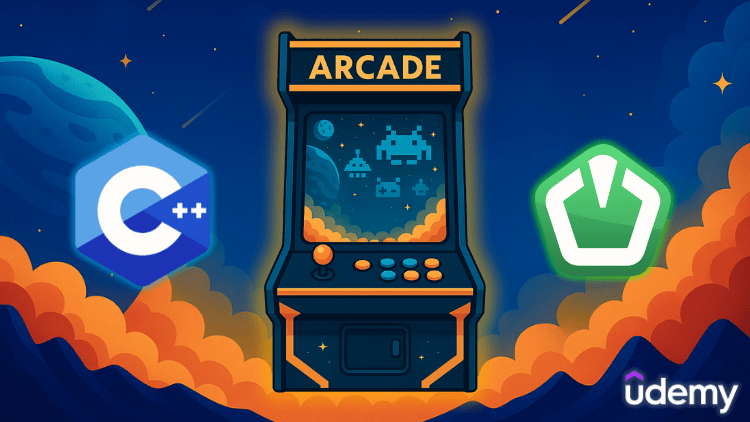
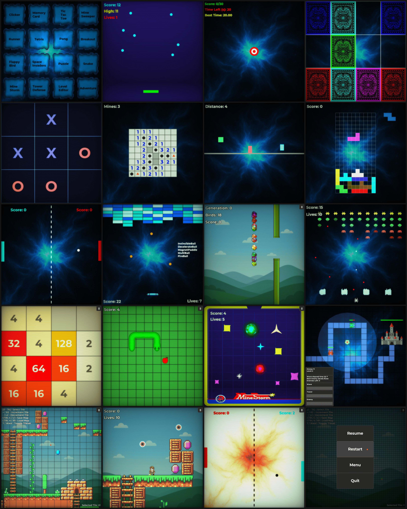

# Arcade Engine

[](https://en.cppreference.com/w/cpp/20)
[]()
[](LICENSE.md)

A modern C++20 game engine designed for fast and efficient 2D game development.
It leverages powerful open-source libraries to handle graphics, audio, data, logging, UI and enums.

## 🎓 Udemy Course

<p align="center">
  <a href="https://www.udemy.com/course/game-engine/?referralCode=BBF9525CF1E8562F9464" target="_blank">
    
  </a>
</p>

<p align="center">
  Learn how to build this engine from scratch in my complete Udemy course.<br>
</p>

## 📦 Dependencies

All dependencies are managed via CMake's FetchContent:

- [SFML 3.0.2](https://github.com/SFML/SFML)
- [nlohmann/json 3.12.0](https://github.com/nlohmann/json)
- [spdlog 1.16.0](https://github.com/gabime/spdlog)
- [TGUI 1.11.0](https://github.com/texus/TGUI)
- [magic_enum 0.9.7](https://github.com/Neargye/magic_enum)

## 🛠️ Prerequisites

* **C++20** compiler (MSVC, GCC or Clang).
* **CMake 3.28+**
* **Git** for cloning.

## 📂 Project Structure

```
ArcadeEngine/
├── CMakeLists.txt
├── Engine/
│   ├── Include/
│   └── Source/
├── Games/
│   ├── Include/
│   └── Source/
└── Content/
```

* **Engine**: Core, Graphics, Managers, Scene, Utils.
* **Games**: Config, Types, Scenes.
* **Content**: Textures, Sounds, Fonts, Shaders, …

## ⚡ Building the Project

```bash
git clone https://github.com/adelhales/ArcadeEngine.git
cd ArcadeEngine
cmake -B Build -D CMAKE_BUILD_TYPE=Debug
cmake --build Build --config Debug -j
```

The executable will be located in `Build/Debug` (or `Build`).

## 🧾 Compiler Options

Strict compilation flags are enabled by default:

* **MSVC**: `/W4 /WX`
* **GCC/Clang**: `-Wall -Wextra -Werror`

## 🎮 Running the Game

Make sure the `Content` folder is in the same folder from which you run the executable.

Keyboard/Mouse and PlayStation/Xbox gamepads are supported.

| Action               | Input                                                     |
|----------------------|-----------------------------------------------------------|
| Launch game (menu)   | Mouse **Left** / Gamepad **South**                        |
| Show controls (menu) | Mouse **Right** / Gamepad **West**                        |
| Toggle pause overlay | `Esc` / Gamepad **Start**                                 |
| Back to menu         | Overlay: **Menu** / `M` / Gamepad **Select**              |
| Restart current game | Overlay: **Restart** / `R`                                |
| Quit application     | Overlay: **Quit** / `Alt` + `F4` / `⌘` + `Q`             |
| Screenshot window    | `Ctrl` + `Shift` + `S` → `Content/Screenshots/`           |

## 📸 Screenshots

<p align="center">
  <a href="Content/Screenshots/Showcase.png">
    
  </a>
  <br/>
  <em>Overview of the 18 Games built with the Engine</em>
</p>

## 📜 License

This project is licensed under the terms of the [MIT License](LICENSE.md).

---

© 2025 Adel Hales
